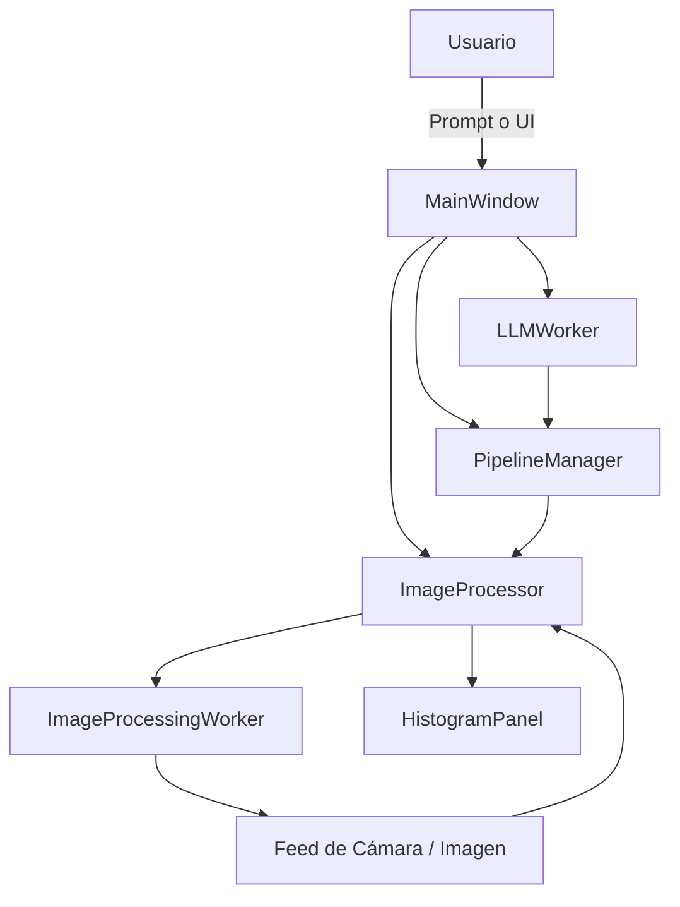

# 🎨 PDI Studio AI

[](https://www.python.org/)
[](LICENSE)
[]()
[](https://huggingface.co/microsoft/Phi-3-mini-4k-instruct-gguf)

> **_Plataforma modular de procesamiento digital de imágenes en tiempo real, asistida por IA generativa local._**

---

## 🧠 Visión General

PDI Studio AI es una plataforma interactiva para diseñar, aplicar y automatizar pipelines de procesamiento digital de imágenes (PDI) en tiempo real. Integra un modelo de lenguaje local (LLM) para generar secuencias de filtros a partir de descripciones en lenguaje natural, y permite al usuario ajustar cada etapa visualmente. Su arquitectura modular permite extenderlo fácilmente a sistemas embebidos, robótica o aplicaciones industriales.

---

## ✨ Características Principales

### Procesamiento de Imágenes en Tiempo Real
- Aplica filtros secuenciales a un feed de cámara.
- Visualiza resultados instantáneamente con histogramas, métricas y vista de diferencia.

### Generación de Pipelines con LLM Local
- Describe el estilo o efecto deseado en lenguaje natural.
- El modelo Phi-3-mini genera automáticamente una secuencia de filtros.
- Fallback inteligente por estilo o reglas predefinidas si el modelo falla.

### Gestión Visual de Pipelines
- Añade, elimina, reordena y ajusta filtros desde una interfaz gráfica.
- Controla parámetros con sliders validados (rango, imparidad, tipo).
- Activa o desactiva filtros individualmente.

### Validación y Robustez
- Todos los parámetros son validados automáticamente según su metadata.
- Se evita el uso de valores inválidos (por ejemplo, kernels pares).
- El sistema detecta y corrige errores silenciosos en tiempo real.

### Asistencia Visual y Análisis
- Histograma interactivo con pyqtgraph (modo RGB o escala de grises).
- Vista de diferencia absoluta entre imagen original y procesada.
- Métricas en tiempo real: PSNR, SSIM, diferencia absoluta.
- Panel desacoplable y colapsable para análisis visual.

### Presets y Reglas
- Guarda pipelines como presets reutilizables.
- Incluye reglas predefinidas para estilos comunes ("blanco y negro", "efecto cómic", etc.).

---

## 🧩 Arquitectura General



- El usuario puede construir pipelines manualmente o describirlos en lenguaje natural.

- El modelo LLM genera filtros que se validan y aplican en tiempo real.

- El procesamiento se ejecuta en hilos separados para mantener la UI fluida.

---

## 🎛️ Filtros Disponibles

| Filtro	| Descripción | Parámetros |
|-----------|-------------|------------|
|convert_to_grayscale | Escala de grises | — |
|invert_colors	| Negativo de imagen	| — |
|apply_gaussian_blur	| Suavizado gaussiano	| ksize (impar) |
|apply_median_blur	| Filtro de mediana	| ksize (impar) |
|apply_canny_edge_detection	| Detección de bordes	| low_threshold, high_threshold |
|adjust_brightness_contrast	| Brillo y contraste	| alpha, beta |
|sepia_tint	| Tono sepia	| strength |
|apply_laplacian_sharpen	| Realce de bordes	| alpha |
|adjust_saturation	| Saturación HSV	| saturation_factor|
|non_local_means_denoising	| Reducción de ruido	| h, h_color, template_window_size, search_window_size|
|bokeh_effect	| Desenfoque radial	| ksize, center_x, center_y, radius |
|equalize_histogram	| Ecualización de histograma |	— |
|apply_sobel_edge_detection | Detección de bordes (Sobel) | — |
|apply_lowpass_fft	| Filtro pasa bajos en frecuencia	| cutoff |

## 🚀 Cómo Empezar

### Requisitos

- Python 3.8 o superior
- Una webcam (opcional)
- Al menos 4 GB de RAM (recomendado para LLM en CPU)
- GPU NVIDIA (opcional, para acelerar el modelo LLM)

---

## ⚙️ Instalación

```bash
git clone https://github.com/paul0pv/pdi_studio_ai.git
cd pdi_studio_ai
python -m venv venv

# MacOS/Linux:
source venv/bin/activate  
# Windows: 
.\venv\Scripts\activate en Windows

pip install -r requirements.txt
```

### Soporte para GPU (opcional)

```bash
pip uninstall llama-cpp-python
pip install llama-cpp-python --extra-index-url https://abetlen.github.io/llama-cpp-python/whl/cu121
```

### Descargar el modelo LLM

  - Modelo: Phi-3-mini-4k-instruct-q4.gguf

  - Fuente: Hugging Face → microsoft/Phi-3-mini-4k-instruct-gguf

```bash
mkdir -p models
# Coloca el archivo .gguf dentro de models/

```

## ▶️ Ejecución

```bash
python main.py
```

## 📂 Estructura del Proyecto

```bash
pdi_studio_ai/
├── config/                  # Presets y configuraciones
├── llm/                     # Generación de pipelines con LLM
├── models/                  # Modelos LLM (.gguf)
├── processing/              # Filtros, validación, procesamiento
├── resources/               # Iconos y recursos visuales
│   └── icons/
├── styles/                  # Temas visuales
├── tests/                   # Pruebas unitarias
├── ui/
│   ├── main_window/         # Componentes de la ventana principal
│   └── widgets/             # Widgets reutilizables (histograma, filtros, presets)
├── video_capture/           # Manejo de cámara
└── main.py                  # Punto de entrada
```

## 🛠️ Funcionalidades Avanzadas

### Procesamiento en hilos separados
| Hilo	| Función |
|-------|---------|
| ImageProcessingWorker	| Aplica filtros a cada frame |
| LLMWorker | Ejecuta el modelo de lenguaje y genera pipelines |
| HistogramTask (QRunnable) | Calcula histograma y métricas sin bloquear la UI|
|HistogramPanel	| Visualización interactiva con pyqtgraph |
| Δ Imagen |	Comparación visual entre original y procesado |
| Validación dinámica |	Rango, tipo, imparidad, etc. |

- Fallback automático si el modelo falla

- Validación dinámica de parámetros

- Selector de cámara y presets reutilizables

- Vista de diferencia absoluta (Δ imagen)

- Panel desacoplable y colapsable

## 🛣️ Futuras Implementaciones

### Nuevos Filtros

  - Transformadas de Hough, operaciones morfológicas, segmentación por color

  - Filtros en el dominio de la frecuencia (FFT, DCT)

### Mejora del LLM

- Confirmación de parámetros atípicos

- Descripción automática de pipelines

- Historial de prompts y respuestas

### UI Avanzada

- Miniaturas por filtro

- Drag & Drop para reordenar

- Vista previa por etapa

- Comparación visual entre pipelines

### Despliegue en Robots/Drones

- Compatible con Raspberry Pi, Jetson Nano, Coral TPU

- Pipelines predefinidos o generados remotamente

- Comunicación por MQTT/WebSocket para actualización dinámica

- Ideal para navegación visual, inspección o agricultura de precisión

## 🧠 Aplicaciones Prácticas

| Sector | Aplicación |
---------|------------|
| Audiovisual | Estilización y corrección visual automatizada |
| Robótica | Preprocesamiento visual para navegación o inspección |
| Educación | Enseñanza interactiva de PDI |
| Gobierno | Restauración de imágenes históricas, vigilancia |
| Industria | Inspección visual, detección de defectos |

## 📜 Licencia

Este proyecto está licenciado bajo MIT. Puedes usarlo, modificarlo y distribuirlo libremente.

